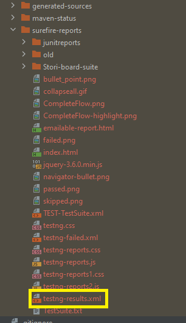
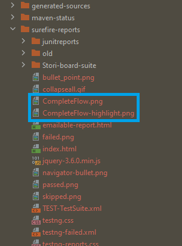
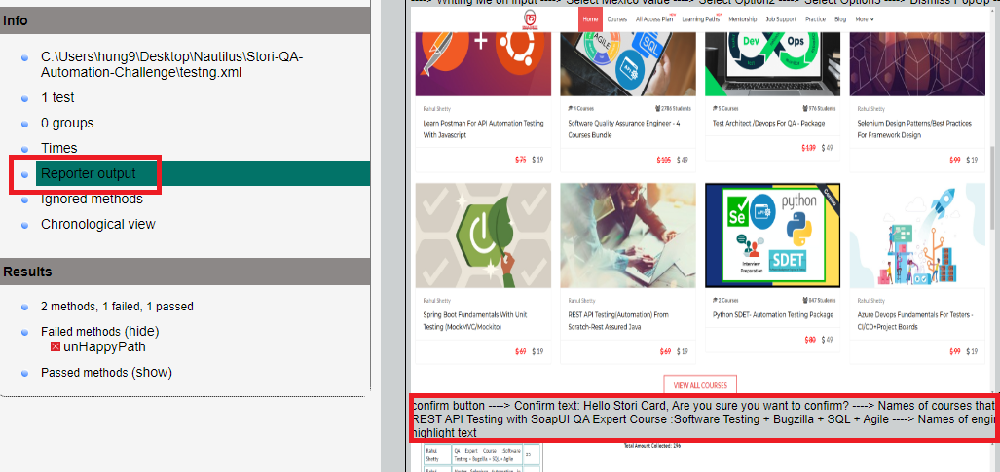

# Stori-QA-Automation-Challenge

This is a resolution of the Stori Automation Challenge using Java & Selenium


## Requirements

Install [Java](https://www.java.com/download/ie_manual.jsp) and setup the [JAVA_HOME](https://confluence.atlassian.com/doc/setting-the-java_home-variable-in-windows-8895.html)

Check the java version from terminal
```bash
  $ java --version
    openjdk 11.0.10 2021-01-19
    OpenJDK Runtime Environment AdoptOpenJDK (build 11.0.10+9)
    OpenJDK 64-Bit Server VM AdoptOpenJDK (build 11.0.10+9, mixed mode)
```

Install [Intellij-IDEA IDE](https://www.jetbrains.com/idea/)

Clone the respository
```sh
git clone git@github.com:Hung9762/Stori-QA-Automation-Challenge-Javascript.git
```

Open the repository with Intellij-IDE and wait for the dependencies to be downloaded and Installed.


## Running Tests from terminal with Chrome/Edge/Firefox

To run tests, run the following command

```bash
  mvn clean && mvn -Dbrowser=chrome test
  mvn clean && mvn -Dbrowser=edge test
  mvn clean && mvn -Dbrowser=firefox test
```


## Tests results

- A new directory with name **target** contains the reports and screenshots
- The HTML & XML report is on the folder **target/surefire-reports**.
- There is two version for the HTML report **index.html** and **emailable-report.html**.
- Inside these reports you can see all the bonus parts like the odd characters and logs of steps the driver is executing.
- The XML reports has the name **testng-results.xml**.

## HTML Report Structure
- These are the html reports available after an execution


- This is the xml report available after an execution



- The screenshots are store within the report directory



- Test steps are inside the HTML report/reporter




## FAQ

#### What happens if the test are not running?

Verify all the dependencies are installed, use the following command

```bash
  mvn verify
```
#### Where is the RTM ?

The RMT is within this repo with the name **Stori-QA-Automation-Challenge-Matrix.xlsx**

## Authors

- [@hung9762](https://github.com/Hung9762)
